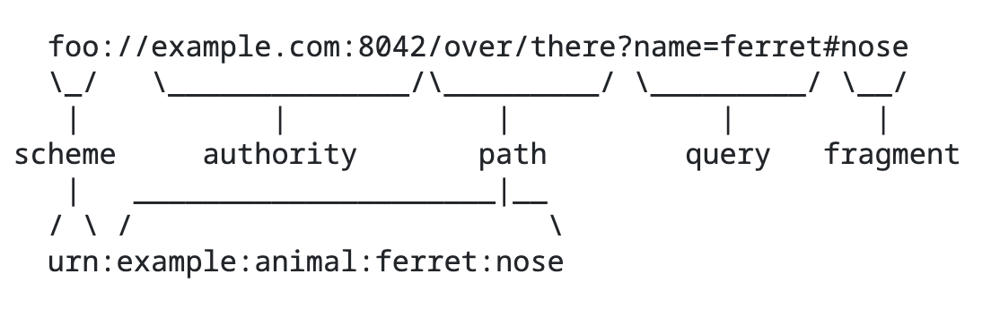

# Verifiable Web Identifiers

'_People want identifiers that are human recognizable AND globally verifiable_'

## What is it?

The verifiable web identifier scheme is based on [RFC 3986](https://datatracker.ietf.org/doc/html/rfc3986) illustrated below:




## Introduction

The verifiable web identifier scheme ```urn:vwi:``` is a proposal to generalize the ```did:web``` method and dns/dnssec resolution/validation methods into a urn scheme that can be used to specify globally unique identifiers that are human-recognizable and easily read to understand the authority. 

A verifiable web identifier (vwi) can be defined as an identifier that can be used for verification functions such as providing verifiable information (.i.e., proofs) about its subject and authentication functionality (challege and response interactions).

A verifiable web identifier would look like this: ```urn:vwi:trustroot.ca:user``` or ```user@trustroot.ca```. Further details below.

## Rationale

A last count, there are 188 did methods in existence. This is not an attempt to introduce the 189th did method but rather to develop a generalizable urn scheme that abstracts the key elements of several approaches and methods into a single concept called the **verifiable web identifier** having the correponding scheme name: ```urn:vwi```

What is a verifiable web identifier? In short, it is an identifier that uses the 'web' (the collection of protocols of tcp/ip, http/https, dns/dnsec, etc) to provide verfiable information about the 'authority' of the identifier. (see following section about 'authority' as defined by the URI specification)

The goal is to introduce a genralized scheme, the verifiable web identitifier scheme (urn:vwi) that leverages:

- the ```did:web``` method to did document information
- DNS/DNSSEC signing and validation, being used by this project, to enable high assurance did:web identifiers.

As the urn:vwi scheme evolves  urn:vwi scheme can be extended to enable verfiability for different use cases:

- providing verifiable information about the vwi owner (like a verifiable credential)
- enabling challenge and response to support authentication transactions
- other use cases as required.

The goal is to enable a simple way for anyone to express their verifiable identifier, such as ```urn:vwi:trustroot.ca:user``` or the more user-friendly format ```user@trustroot.ca``` (yes, it looks just like an email address) to provide verifiable information or enable others to discern publicly verifiable information about the subject of the verifiable web identifier. (Note: It can also be privately verifiable information as well)

## Leveraging URI Syntax

According the syntax components of [RFC 3986 Uniform Resource Identifier (URI): Generic Syntax](https://datatracker.ietf.org/doc/html/rfc3986), 'authority' within a URI is depicted as a URL and URI:

```bash
foo://example.com:8042/over/there?name=ferret#nose
         \_/   \______________/\_________/ \_________/ \__/
          |           |            |            |        |
       scheme     authority       path        query   fragment
          |   _____________________|__
         / \ /                        \
         urn:example:animal:ferret:nose

```

Examples are vwis are as follows:

```bash
urn:vwi:trustroot.ca                        # basic example
urn:vwi:credentials.trustroot.ca            # subdomain example
urn:vwi:engineers.trustroot.ca              # subdomain for a engineering professional assocation
urn:vwi:john.smith@engineers.trustroot.ca   # for an individual
```

The root of trust of a verifiable identifier can easily discerned from the identifier: ```trustroot.ca``` is part of ```.ca``` and, in turn, ```engineers``` is part of ```trustroot.ca```


If the context is known, e.g., ```urn:vwi``` then the identifiers can be further simplified to:

```bash
trustroot.ca                        # basic example
credentials.trustroot.ca            # subdomain example
engineers.trustroot.ca              # subdomain for a engineering professional assocation
john.smith@engineers.trustroot.ca   # for an individual
```

If these look like email addresses, it's because email address are of the same urn syntax: ```urn:mailto:info@example.com``` and due to common usage, the ```urn:mailto:``` prefix is assumed and dropped.

## Embracing What Is Already Built

```urn:vwi``` is intended to be scheme that does not invent anything new.  Instead, ```urn:vwi```leverages existing composable components that are already accepted broadly.

There area three broad functional areas: resolution, verifiability, and extensibility.

### Resolution

Resolution is the function to retrieve metadata or mapped data related to a ```urn:vwi``` identifier.

- ```urn:vwi``` resolution would follow the same standard conventions for W3C ```did:web``` specification for resolution to retrieve the did doc

### Verifiability

Verifiability is the function of verifying/validation the integrity of data by cryptographic means or non-cryptographic means (for legacy identifiers)

- ```urn:vwi```would follow the same standard conventions for document integrity that can be defined according the W3C DID DOC integrity specification.
- ```urn:vwi``` would follow the methods for validation that are defined by DNS, DNNSEC and associated cryptographic algorithms.

### Extensibility

Extensibility is the means by which addition functionality can be added to further enrich resolution or to enahnce interactions with the ```urn:vwi```. For example a ```urn:vwi``` can be extended to support specialized queries or support specialized interactions such as authentication protocols.

- ```urn:vwi``` would follow the same standard conventions for defining service endpoints that can be defined according the W3C DID specification.

This would enable the introspection of a ```urn:vwi``` identifier for additional capabilitiies suchs as WHOIS (publicy verifiable information)

